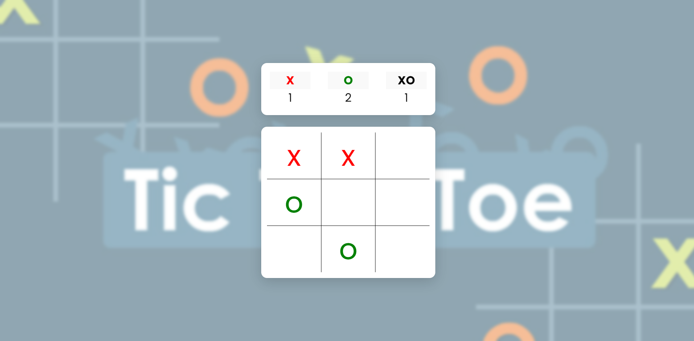

# TicTacToe Game

## Overview
The TicTacToe Game project offers a complete solution for playing the classic Tic-Tac-Toe game. This interactive tool enables users to:

- **Play a Classic Game of Tic-Tac-Toe:** Engage in a standard 3x3 grid game where players alternate turns to mark Xs and Os.
- **Track Player Scores:** Monitor and display scores for both players, including wins and draws.
- **Automatically Reset the Game:** After a game ends, the board resets for a new round of play.

Whether you're looking to play Tic-Tac-Toe casually or track player performance over multiple rounds, this project provides a robust and user-friendly experience.

## Features
- **Interactive Game Board:** Clickable buttons on a 3x3 grid for players to make their moves.
- **Score Tracking:** Keeps track of wins and draws for both players.
- **Automatic Reset:** Resets the board after each game, ready for a new round.
- **Real-time Updates:** Displays scores and game results dynamically.

<a href="https://vinicius-rodriguess.github.io/TicTacToe-Game" target="_blank">Click here to test the project!</a>

