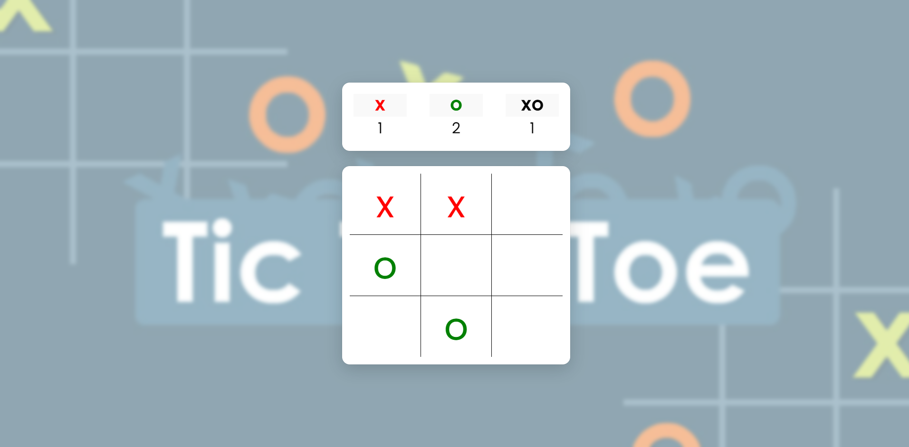

# 🎮 **Jogo da Velha**

O projeto **Jogo da Velha** é uma aplicação interativa que permite aos usuários jogarem o clássico jogo da velha (ou tic-tac-toe). O jogo é projetado para acompanhar a pontuação e identificar automaticamente o vencedor de cada rodada.

---

## 🚀 **Funcionalidades**

- **Jogabilidade Interativa**: Dois jogadores podem alternar entre os turnos jogando com "X" e "O".
- **Detecção Automática de Vitória**: O sistema verifica e anuncia automaticamente o vencedor ou um empate ao final de cada rodada.
- **Placar Atualizado em Tempo Real**: Pontuação dos jogadores e empates são exibidos e atualizados ao longo do jogo.
- **Reinício Automático**: Após cada rodada, o tabuleiro é reiniciado automaticamente para uma nova partida.

---

## 🛠️ **Tecnologias Utilizadas**

- **HTML5**: Estrutura da interface.
- **CSS3**: Estilização e animações visuais.
- **JavaScript (ES6)**: Lógica do jogo e manipulação do DOM.

---

## 🔧 **Como Executar o Projeto**

<a href="https://vinicius-rodriguess.github.io/TicTacToe-Game" target="_blank">Clique aqui para testar o projeto!</a>



Ou então:

1. **Clone este Repositório**:

   ```bash
   git clone https://github.com/Vinicius-Rodriguess/TicTacToe-Game.git
   cd jogo-da-velha
   ```

2. **Abra o Arquivo no Navegador**:

   Não é necessário instalar dependências. Basta abrir o arquivo `index.html` em qualquer navegador moderno.

---

## 🖥️ **Exemplo de Uso**

1. **Inicie o Jogo**:
   - Clique em qualquer célula vazia para fazer sua jogada.

2. **Acompanhe o Placar**:
   - Veja a pontuação de cada jogador e a quantidade de empates atualizada em tempo real.

3. **Continue Jogando**:
   - Após cada rodada, o tabuleiro é reiniciado automaticamente para você jogar novamente.

---

## ✅ **Melhorias Futuras**

- Implementar um modo de jogo contra a IA.
- Adicionar opções de personalização de temas e estilos.
- Disponibilizar suporte para dispositivos móveis com design responsivo aprimorado.

---

## 👨‍💻 **Autor**

**Vinicius Rodrigues**

- GitHub: [Vinicius-Rodriguess](https://github.com/Vinicius-Rodriguess)
- Email: rodrigues.vini.2004@gmail.com

